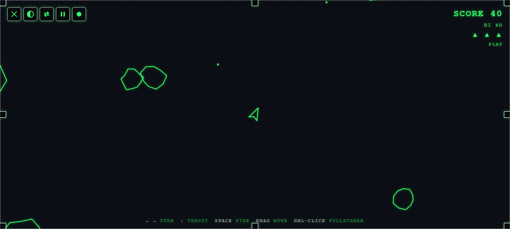

# 🚀 PewPew

A **transparent, click-through, always-on-top** desktop overlay that drops an
**8-bit white Asteroids** arcade game right on top of your screen — fly a
fighter ship, blast asteroids into smaller chunks, rack up a score… all while
your code (or anything else) keeps running **behind** it.

Flip on click-through and it becomes an ambient screensaver of drifting
asteroids floating over your editor — graphics on top, your work fully usable
underneath.


---

## ✨ Features

- **True overlay** — frameless, transparent, always-on-top window. White
  wireframe graphics float over your desktop; everything else is see-through.
- **Click-through mode** — let mouse + keyboard fall through to the apps behind
  so you can keep coding, with the game still drifting on top.
- **Two modes**
  - **PLAY** — steer the ship, thrust, fire, split asteroids, score, avoid
    collisions (3 lives).
  - **AMBIENT** — asteroids just drift across the screen, screensaver-style,
    for when you don't want to play but want the vibe.
- **8-bit vector look** — chunky wireframe ship & asteroids, pixel bullets,
  particle explosions. Shoot a big rock → it breaks into smaller ones.
- **Color themes** — cycle **White → Retro Green (CRT phosphor) → Amber → Cyan →
  Auto**. The retro green reads great over a code editor; **Auto** samples the
  desktop behind the transparent window and flips the graphics to a contrasting
  color (e.g. green on a dark terminal) so they stay visible. The whole UI
  recolors together. Click the color swatch icon or press `Ctrl/Cmd+Shift+C`.


- **Score / lives HUD** in the top-right, with a persistent high score and a
  `+points` tile that pops on the right each time you bust a rock.
- **Move & resize, visually** — a dashed outline traces the window edge with 8
  drag grips so you can scale it precisely; **drag the top-left bar** to move it,
  and **double-click** that bar to toggle fullscreen.
- **Icon controls that get out of the way** — a clean white icon cluster
  (✕ quit · click-through · play/ambient · pause) that **auto-hides after a few
  seconds**; **jiggle the mouse in the top-left corner** to bring it back.
- **Always a way back** — global shortcuts (with fallback combos if another app
  owns one) plus the always-reachable on-screen controls, since a frameless
  window has no title bar.

| Menu | Ambient (drifting over code) |
| --- | --- |
|  |  |

---

## 🎮 Controls

| Action | Key |
| --- | --- |
| Turn left / right | `←` `→` (or `A` / `D`) |
| Thrust | `↑` (or `W`) |
| Fire | `Space` |
| Start / retry | `Space` / `Enter` |
| Toggle **click-through** | `Ctrl/Cmd + Shift + O` |
| Toggle **Play ↔ Ambient** | `Ctrl/Cmd + Shift + G` |
| Pause | `Ctrl/Cmd + Shift + P` |
| **Change color** | `Ctrl/Cmd + Shift + C` |
| **Quit** | `Ctrl/Cmd + Shift + Q` |

### Moving, resizing & the controls

- **Move:** just **click and drag anywhere** on the overlay — the whole surface
  is a drag handle, so you can throw it across monitors easily.
- **Fullscreen:** **double-click the top-left corner** (the controls area) to
  fill the screen; double-click again to restore the previous size.
- **Resize:** drag any of the 8 grips on the white outline that traces the
  window edge. (Native edge-drag also works.)
- **Show/hide controls:** the icon cluster and resize outline fade out after a
  few idle seconds — move the mouse into the **top-left corner** to reveal them.
- **Icons (left → right):** ✕ quit · ◐ click-through · ⇄ play/ambient · ⏸ pause
  · ⬤ color (cycles White / Green / Amber / Cyan / Auto).

> When click-through is **on**, the window ignores the mouse so clicks land on
> whatever is behind it. The icon cluster stays clickable in the top-left —
> click the **◐ click-through** icon (or press `Ctrl/Cmd+Shift+O`) to take
> control back. (Move/resize are disabled during click-through — exit it first.)

---

## 📦 Install & Run

You need [Node.js](https://nodejs.org) (v18+).

```bash
git clone https://github.com/LucaXav/pewpew.git
cd pewpew
npm install      # downloads Electron
npm start        # launches the overlay
```

That's it. The overlay opens on top of everything. Press `Ctrl/Cmd+Shift+Q` to
quit.

### Put it on your Desktop + a global hotkey

To get a **PewPew icon on your Desktop and Start Menu** (with the app logo) and a
**global launch hotkey**:

```bash
npm run install-desktop
```

This creates `PewPew` shortcuts that launch the overlay with no console window,
and binds them to **`Ctrl + Shift + F7`** — press it anywhere to open PewPew (if
it's already running, the hotkey just brings it to the front). Windows only.

### Launch from the command line

```bash
npm start            # from the project folder

# or install a global `pewpew` command:
npm install -g .     # (or: npm link)
pewpew               # launches the overlay from anywhere
```

### Try the game in a plain browser (no Electron)

The renderer runs in any browser too — handy for tweaking the game:

```bash
npm run serve    # serves a test page with a fake "code" background
# open http://localhost:4173/
```

---

## 🧠 How it works

PewPew is a faithful implementation of the click-through transparent overlay
technique:

- **`main.js`** — creates a `BrowserWindow` with `transparent: true`,
  `frame: false`, `alwaysOnTop: true`, sized to the display's work area. It
  owns click-through via `win.setIgnoreMouseEvents(on, { forward: true })`
  (`forward: true` keeps mouse-move flowing to the page for hover hit-testing
  while clicks pass through), and registers the global shortcuts.
- **`preload.js`** — a tiny `contextBridge` API (`window.pew`) so the renderer
  can request click-through, get notified of changes, and quit — without
  exposing Node to the page.
- **`renderer/`** — the game, split into small ES modules under `src/`. They
  draw white wireframes on a transparent `<canvas>` (cleared to alpha 0 every
  frame), run the physics/collision loop, and handle the score HUD, modes,
  themes, and the come-back chrome. `src/main.js` is the entry point that wires
  them together.

The transparency only works because **every layer is transparent**: the page
background, the body, and the canvas are all alpha 0, so only the white shapes
are drawn and the desktop shows through everywhere else.

### Project layout

```
pewpew/
├── main.js                  # Electron main (window, click-through, move/resize, shortcuts)
├── preload.js               # contextBridge API (window.pew)
├── bin/pewpew.js            # `pewpew` CLI launcher
├── renderer/
│   ├── index.html           # overlay markup (canvas + drag surface + HUD + controls)
│   ├── style.css            # transparent, white, pixel-ish styling
│   └── src/                 # the game, as focused ES modules
│       ├── main.js          # entry: boots modules, runs the loop, wires IPC
│       ├── config.js        # tunable constants + lookup tables
│       ├── bridge.js        # the window.pew Electron bridge (or null in a browser)
│       ├── view.js          # transparent canvas + DPR-aware sizing
│       ├── utils.js         # rand/randi + toroidal screen wrap
│       ├── state.js         # the shared mutable game state
│       ├── entities.js      # ship / asteroid / particle factories
│       ├── hud.js           # score-lives DOM overlay, banner, +N pops
│       ├── engine.js        # lifecycle, input, physics + collision update
│       ├── render.js        # draws the scene each frame
│       ├── themes.js        # color themes + auto background sampling
│       └── chrome.js        # auto-hide controls, move/resize, fullscreen
├── assets/                  # generated app icon (pewpew.png / pewpew.ico)
├── tools/
│   ├── serve.js             # zero-dep static server for browser testing
│   ├── make-icon.js         # procedural icon generator (PNG + ICO)
│   └── install-shortcut.ps1 # creates the Desktop/Start-Menu shortcut + hotkey
├── test/index.html          # browser test harness (fake code background)
└── docs/                    # screenshots
```

---

## ⚠️ Notes & gotchas

- **Frameless window has no ✕** — quit with `Ctrl/Cmd+Shift+Q`.
- **Global shortcut taken?** If a shortcut doesn't register, another app owns
  that combo; close it or change the accelerator in `main.js`.
- **Transparency on Linux** depends on a running compositor.
- Built and verified on Windows 11 with Electron 33.

---

## 📜 License

MIT © LucaXav
